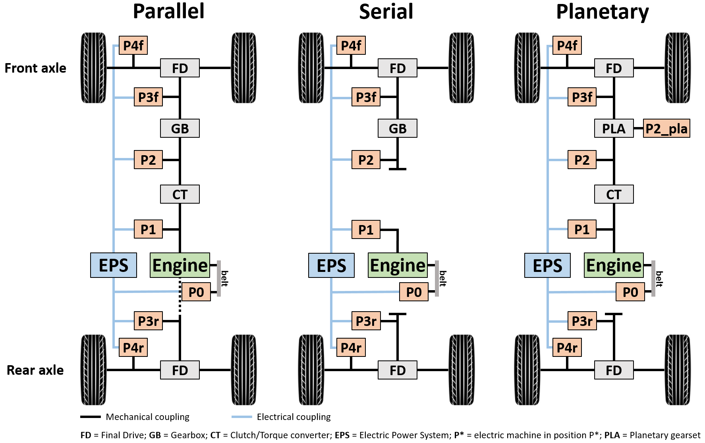
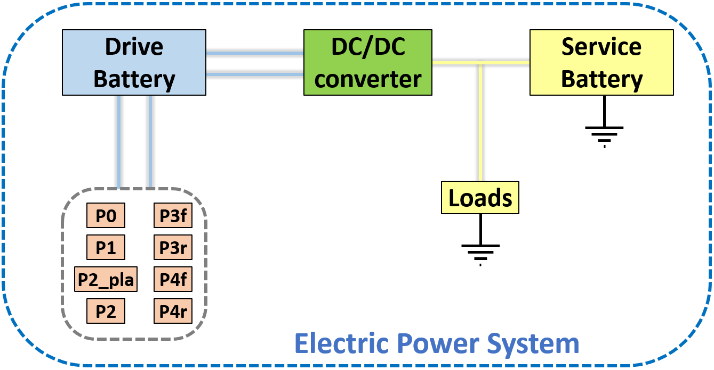
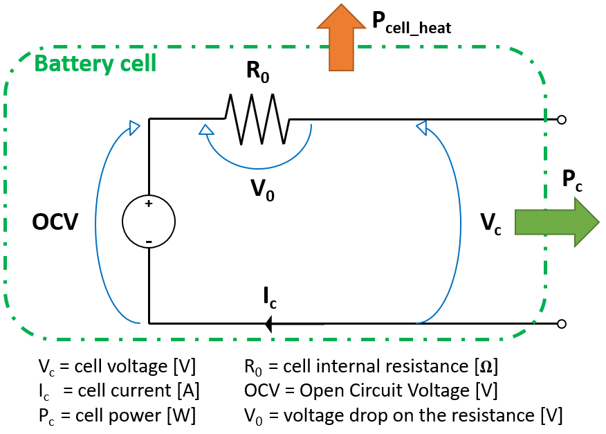

###############
|co2mpas| Model
###############

.. module:: co2mpas.core.model
   :noindex:

CO2MPAS model is plotted here below: you can explore the diagram nests by
clicking on them.

.. _model_diagram:

.. raw:: html

    <iframe frameBorder="0" src="https://jrcstu.github.io/co2mpas/model/?url=https://jrcstu.github.io/co2mpas/model/core/CO2MPAS_model.html" height="500px" width="100%" allowfullscreen></iframe>

The execution of |co2mpas| model for a single vehicle is a procedure in three
sequential stages:

  - **Calibration stage**: identifies, calibrates, and selects the best
    physical models (see next section `Model selection`_) from WLTP input data
    (i.e., ``input.calibration.<cycle>``).
  - **Model selection stage**: selects the best calibrated models
    (i.e., ``data.prediction.models_<cycle>``) to be used in the prediction stage.
  - **Prediction stage**: forecasts the |CO2| emissions using the user's inputs
    (i.e., ``input.prediction.<cycle>``) and the calibrated models. If some/all
    WLTP inputs are not provided, the function
    :py:func:`select_prediction_data <select_prediction_data>` chooses those
    required to predict |CO2| emissions from ``output.calibration.<cycle>``.

.. module:: co2mpas.core.model.selector.models
   :noindex:

The :py:obj:`physical model <co2mpas.core.model.physical.dsp>` is used in both
stages: calibration (i.e., ``calibrate_with_<cycle>``) and prediction (i.e.,
``predict_<cycle>``). The identified/calibrated parameters from WLTP
data (i.e., ``data.prediction.models_<cycle>``) can be grouped by functionality
in eight macro-models:

  #. :py:obj:`A/T <at_model>`: gear shifting strategy for automatic transmission,
  #. :py:obj:`electrics <electrics_model>`: vehicle electric components (
     i.e., alternator, service battery, drive battery, and DC/DC converter),
  #. :py:obj:`clutch-torque-converter <clutch_torque_converter_model>`:
     speed model for clutch or torque converter,
  #. :py:obj:`co2_params <co2_params>`: extended willans lines parameters,
  #. :py:obj:`after-treatment <after_treatment_model>`: warm up strategy of
     after treatment,
  #. :py:obj:`engine-coolant-temperature <engine_coolant_temperature_model>`:
     warm up and cooling models of the engine,
  #. :py:obj:`engine-speed <engine_speed_model>`: correlation from velocity to
     engine speed,
  #. :py:obj:`control <control_model>`: start/stop strategy or ECMS.

Model selection
===============
The default model selection criteria (i.e., when ``enable_selector == False``)
are to use the calibrated models from *WLTP-H* data to predict *WLTP-H* and
*NEDC-H* and from *WLTP_L* data to predict *WLTP-L* and *NEDC-L*.

On the contrary, if the selector is enabled, the function
:py:func:`extract_calibrated_model <co2mpas.core.model.selector.dsp>`
detects/selects the best macro-model for prediction (from *WLTP-H* or *WLTP-L*).
The selection is performed according to the model's score, which is the model
capability to reproduce the input data, i.e. a weighted average of all computed
metrics.

In other words, the calibrated models are used to recalculate (**predict**) the
**inputs** of the *WLTP-H* and *WLTP-L* cycles, while the scores are derived
from various metrics comparing **inputs** against **predictions**.

.. note::
   A success flag is defined according to upper or lower limits of scores which
   have been defined empirically by the JRC. If a score is outside the model
   fails the calibration and a warning is logged.

.. _substs:

.. |CO2MPAS| replace:: CO\ :sub:`2`\ MPAS
.. |CO2| replace:: CO\ :sub:`2`

Hybrid electric vehicles model
==============================
Hybrid Electric Vehicles (HEVs) have more complex driveline layouts and control
strategies compared to conventional vehicles. Their driveline integrates one or
more electric machines for supporting propulsion and/or charging the drive
battery, to regenerate braking power, using the engine at a more optimal
operating point or even switching it off when appropriate. Therefore, additional
components are needed for the simulation of their operation: electric
machines, drive battery and DC/DC converter. The vehicle powertrain model of
|co2mpas| is developed in a way to capture and replicate the operation of as
many different vehicle architectures as possible through a unique driveline
virtual architecture.

Hybrid electric architectures
-----------------------------
Three main architectures can be identified for HEVs driveline:

#. **Parallel** hybrids are similar to conventional vehicles as the engine
   produces mechanical power that is directly used for propulsion; also, engine
   rotational speed is a function of the rotational speed of the wheels
   according to the reduction/multiplication effect applied by final drive and
   gearbox (when present). The electrical machines are used to regenerate
   braking energy and optimise the load of the engine, but they cannot adjust
   the rotational speed of the engine when a gear is selected.
#. **Serial** hybrids have an additional degree of freedom for the optimisation,
   as both the load and the rotational speed of the engine can be selected by
   the controller. This is possible due to the lack of a mechanical coupling
   between the engine and the wheels. Therefore, a serial hybrid is always
   propelled by the electric machines and the engine is used to generate
   electrical energy that is used for propulsion or battery charging.
#. **Planetary** architecture is instead a driveline configuration that can
   accomplish, to some extent, the operation of the two architectures previously
   mentioned. The engine can provide mechanical power that is directly used for
   propulsion, but at the same time, its rotational speed can be adjusted by the
   controller becoming independent from wheel speed. This system normally
   replaces the conventional transmissions (gearboxes and CVTs) as it can adjust
   the reduction gear ratios to any wanted value, and it integrates two electric
   machines (one generating and the other one consuming electrical energy).

Electric power system
---------------------
The Electric Power System (EPS) of HEVs is composed by three main components:

- Electric machines (P0, P1, P2, P2_pla, P3f, P3r, P4f, and P4r),
- Batteries (Drive and Service, i.e. high and low voltage batteries), and
- DC/DC converter

The electric machines convert electrical energy into mechanical energy when they
need to propel the vehicle and mechanical energy into electrical during
regenerative braking or battery charging. This electrical energy, consumed or
generated, is exchanged with the drive battery. The DC/DC converter is the
component in charge of allowing the energy exchange between the drive battery
and the low-voltage electric system of the vehicle, to supply the electrical
consumers and charge the service battery when needed.

The efficiency of the **drive battery** is modeled using the
**equivalent-circuit cell model** (see image below). The drive battery is seen
as a set of battery cells with equal characteristics and size, with a certain
combination of cells in series and circuits in parallel. Each cell of the
battery suffers of a power loss that is proportional to the cell internal
resistance *R0* and the current flowing through it, that is transformed to heat.
The performance obtained by the battery is then calculated by considering how
many cells in series and parallel are constituting the battery.

Control strategy
----------------
The control unit of an HEV runs an optimisation strategy to control the hybrid
powertrain and assign the target power to each component (engine and electric
machines). The adopted strategy adopted in |co2mpas| is the **Equivalent
Consumption Minimisation Strategy** (**ECMS**), which assigns an equivalent
cost - in terms of fuel - to electrical energy use. The strategy evaluates the
combination of engine and drive battery power that minimises the overall
equivalent energy consumption.
